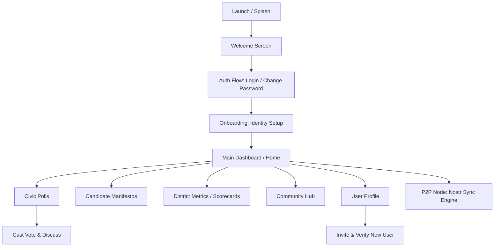

# PROJECT MASTER FILE - WeTheGoverned (Android & Desktop)

**Project Name:** WeTheGoverned (WETHEGOVERNED)
**Package Name:** net.wetheGoverned
**Last Updated:** <!-- DATE_START -->2026-07-08<!-- DATE_END -->
**Target SDK / Compile SDK:** 35
**Min SDK:** 24
**Architecture:** MVVM / Clean Architecture / Multiplatform (KMP)

## 1. Project Overview
- **Type:** Kotlin Multiplatform (Android + Desktop + iOS)
- **Main Purpose:** A decentralized civic platform designed to empower citizens through participating in district-level polls, tracking representative performance (Scorecards), and managing a localized network of trust. It uses the Nostr protocol for decentralized identity and P2P data synchronization.
- **Key Features:**
    - **Decentralized Identity:** Uses Secp256k1 keypairs (Nostr) for user identity without central authority.
    - **Verified Network of Trust:** Invitation-only registration system where verified users can vouch for and add new residents.
    - **Geographical Usernames:** Automatically generates IDs based on location (e.g., FL064321).
    - **Civic Governance:** Multi-level polling (Federal, State, District, Local) with weighted voting logic.
    - **P2P Sync Engine:** Real-time data synchronization across nodes using Nostr relays.
    - **Community Hub:** Integrated board for marketplace posts, jobs, and community announcements.
    - **Multi-Platform Nodes:** Runs on Android, Desktop (JVM), and iOS.
- **Tech Stack:**
    - **Language:** Kotlin
    - **UI:** Jetpack Compose (Multiplatform)
    - **Asynchronous:** Coroutines & StateFlow
    - **Networking:** Ktor (Client & Server)
    - **Synchronization:** Nostr (P2P Relay Management)
    - **Storage:** Java Preferences (Desktop), Room/DataStore (Android)
    - **Build System:** <!-- GRADLE_VERSION_START -->Gradle (8.13)<!-- GRADLE_VERSION_END -->

## 2. High-Level App Workflow


**Detailed Workflow Steps:**
1. **Welcome/Auth:** Users enter through a Welcome screen. Login requires a pre-created geographical username.
2. **First Login:** Users with temporary passwords (`temp_` prefix) are prompted to use the **Change Password** flow.
3. **Identity Setup:** Onboarding generates or imports Nostr keys (nsec/npub). No address/MFA check required for initial access.
4. **Dashboard:** Home displays active polls and navigation to key features.
5. **Network Expansion:** Verified users access a "Register New User" screen from their profile to manually add residents using name, address, and district info.
6. **Data Sync:** All votes, polls, and profiles are synced via `P2PSyncEngine` across global relays.

## 3. Project Structure
<!-- STRUCTURE_START -->
```text
WETHEGOVERNED/
├── app/                        # Android-specific module
│   └── src/main/java/net/wetheGoverned/
│       ├── data/               # Android Data implementations (Firestore/Auth)
│       └── ui/screen/          # Android UI (Screen components)
├── shared/                     # Multiplatform Logic & UI
│   ├── src/commonMain/kotlin/net/wetheGoverned/
│   │   ├── core/               # Key Management (Secp256k1), Utilities
│   │   ├── data/               # P2P Sync Engine, Nostr Relay Manager
│   │   ├── model/              # CivicModels, UserAccount, Polls
│   │   ├── repository/         # Repository Interfaces
│   │   ├── session/            # SessionManager, UserSession
│   │   └── ui/                 # Shared Composables & ViewModels
│   ├── src/androidMain/        # Android-specific UI & Location Helper
│   ├── src/iosMain/            # iOS-specific UI (MainViewController)
│   └── src/desktopMain/        # Desktop-specific UI & Repository implementations
├── iosApp/                     # iOS Application (Xcode project & Pods)
├── gradle/                     # Gradle Wrapper & Version Config
├── PROJECT_MASTER.md           # This Context File
└── build.gradle.kts            # Root Build Config
```
<!-- STRUCTURE_END -->

## 4. Core Architecture & Patterns
- **Architecture pattern used:** MVVM (Model-View-ViewModel) with a shared UI layer in Compose.
- **Dependency Injection:** Hilt (Android), Manual DI / Factory pattern (Shared/Desktop).
- **Navigation:** Jetpack Compose Navigation (Shared routes in `App.kt`).
- **UI Layer:** 100% Jetpack Compose Multiplatform.
- **Data Layer:** Repository pattern with separate implementations for Desktop (Preferences/In-memory) and Android (Firestore/Local DB).
- **Key Design Patterns:** Observer (StateFlow), Singleton (RelayManager), Strategy (Platform-specific Repositories).

## 5. Important Packages & Their Responsibilities
| Package | Responsibility | Key Classes |
| :--- | :--- | :--- |
| `net.wetheGoverned.ui` | Main UI Screens & Shared ViewModels | `AuthViewModel`, `ResidentProfileViewModel`, `ManifestoViewModel` |
| `net.wetheGoverned.model` | Core data structures for the civic domain | `CivicPoll`, `ResidentProfile`, `UserAccount` |
| `net.wetheGoverned.repository`| Data access abstraction | `ResidentRepository`, `PollRepository`, `AccountRepository` |
| `net.wetheGoverned.data` | Synchronization and API layers | `P2PSyncEngine`, `NostrRelayManager`, `CivicApi` |
| `net.wetheGoverned.session` | User session lifecycle & persistence | `SessionManager`, `UserSession`, `SessionStorage` |
| `net.wetheGoverned.core` | Cryptography and core utilities | `Secp256k1KeyManager`, `Bech32Codec` |

## 6. Key Files & Entry Points
| File | Purpose | Importance |
| :--- | :--- | :--- |
| `App.kt` | Main Navigation Host & Shared UI Entry | ★★★★★ |
| `MainViewController.kt` | iOS Application Entry Point | ★★★★★ |
| `Main.kt` (Desktop) | Desktop application entry and Node initialization | ★★★★★ |
| `P2PSyncEngine.kt` | Manages Nostr subscriptions and real-time data sync | ★★★★★ |
| `AuthViewModel.kt` | Handles Login, Registration (Invitations), and Passwords | ★★★★★ |
| `ResidentProfileScreen.kt`| Profile management and "Invite User" entry point | ★★★★ |
| `NetworkRegistrationScreen.kt`| Manual user verification and ID generation logic | ★★★★ |
| `DesktopRepositories.kt` | Persistence logic for the desktop version | ★★★★ |

## 7. Data Flow & State Management
- **Flow:** `P2PSyncEngine` (incoming event) → `Repository` (sync/save) → `ViewModel` (observe Flow) → `UI` (collectAsState).
- **UI Interaction:** `UI` (event) → `ViewModel` (action) → `Repository` (save/send) → `P2PSyncEngine` (publish to Nostr).
- **State Management:** Primary use of `StateFlow` within ViewModels to expose immutable UI state to Composables.

## 8. Important Modules / Features
- **Shared Module:** Contains 90% of the code, including UI, models, and business logic.
- **Desktop Node:** The Desktop `Main.kt` ensures the node remains active in the system tray for relay connectivity.
- **Verification System:** A tiered verification system (Tier 1-3) that controls voting weight and permission to invite others.

## 9. Build & Configuration
<!-- BUILD_CONFIG_START -->
- **Gradle Version:** 8.13
- **Kotlin Version:** 2.0.21
- **AGP Version:** 8.13.2
- **Key Dependencies:** Ktor (Networking), Compose Multiplatform (1.7.0), kotlinx-serialization, kotlinx-datetime.
- **Compatibility:** iOS targets (iosX64, iosArm64, iosSimulatorArm64) configured via CocoaPods.
- **Platform Specifics:** JVM-only dependencies (Ktor Server, Web3j) isolated to `androidMain` and `desktopMain`.
<!-- BUILD_CONFIG_END -->

## 10. Coding Standards & Conventions
- **Naming:** CamelCase for classes, camelCase for functions/variables. ViewModel state ends in `UiState`.
- **Error Handling:** Result monad used for repository and API calls.
- **State:** Prefer `update { ... }` on `MutableStateFlow` for thread-safe state mutations.
- **Security:** Private keys (nsec) are handled in `commonMain` but persisted using platform-specific secure storage where possible.

## 11. Future Roadmap & TODOs
- [ ] Implement full Nostr NIP-01 event signing for all civic actions.
- [ ] Add Room database for shared persistence (KMP).
- [ ] Enhance SQLDelight integration for complex poll aggregation.
- [ ] Implement local mesh discovery (mDNS/Bluetooth) via `MeshDiscoveryManager`.
- [ ] Add encrypted DMs (NIP-04) for verifier-to-resident communication.
